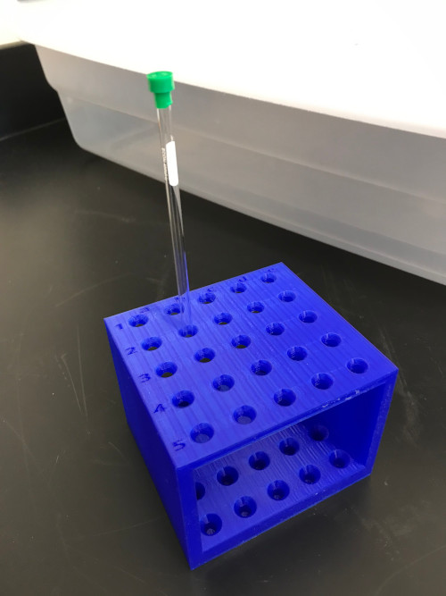

# 3D Printable NMR Tube Rack

The following files are for printing a freely-available NMR tube holder rack capable of holding up to 25 NMR tubes. If printed on its side, this rack is printable without the need for supports or any post-processing. The following photos are of the rack printed on an Ultimaker 2+ using PLA with a 0.4 mm nozzel.

